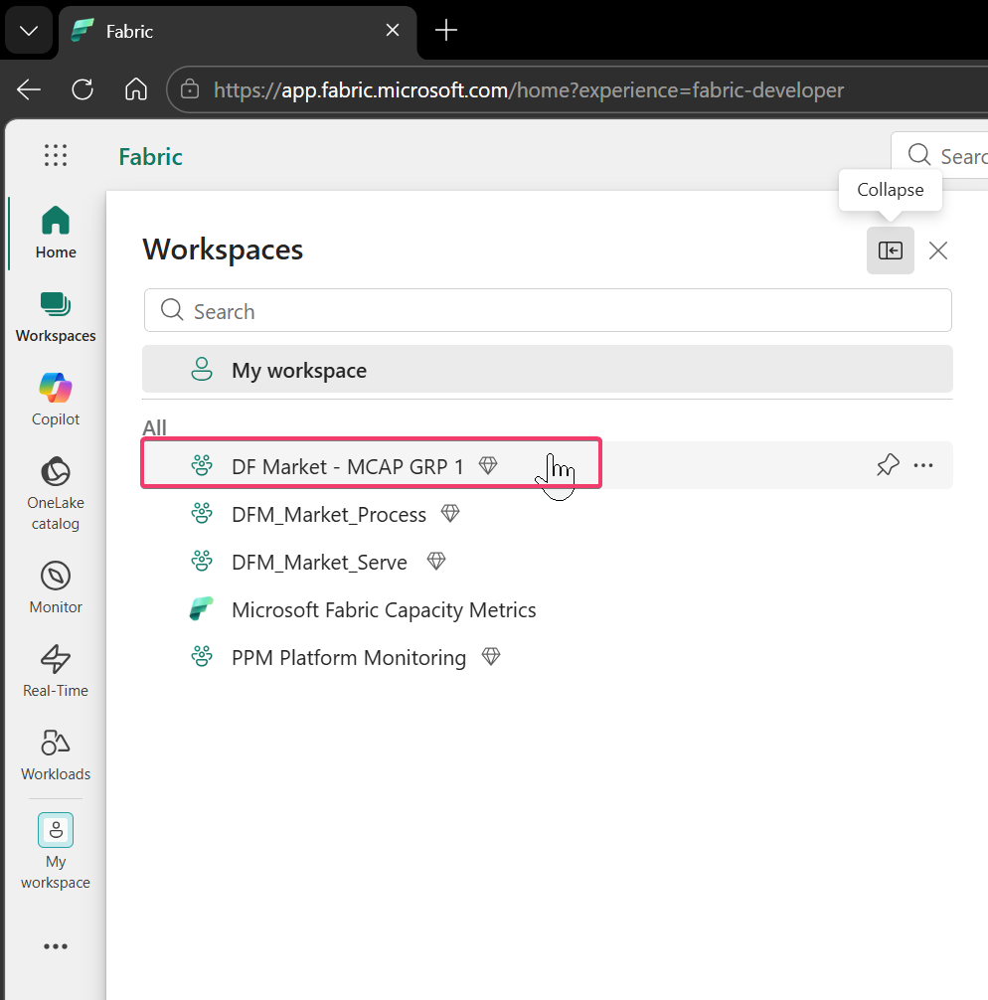
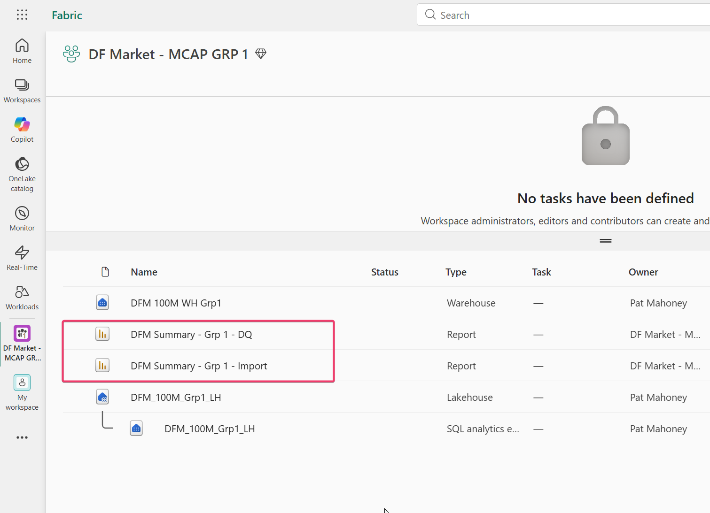
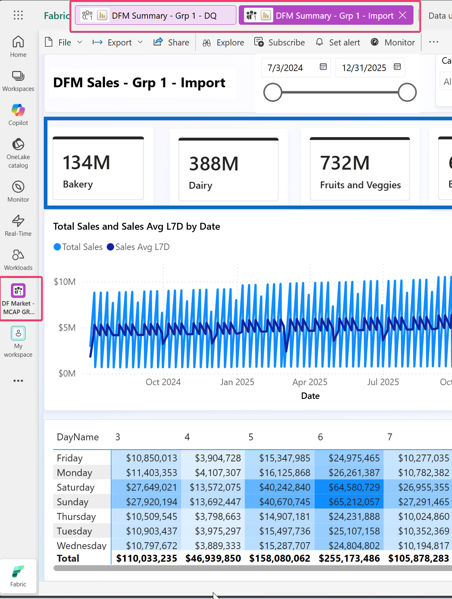

# Managing Capacities - Access DFM Summary Report

## Lab 1

### Step 1
In Workspaces, you should also see the following workspaces:

- a. Microsoft Fabric Capacity Metrics
- b. DF Market - MCAP GRP 1 / 2
- c. DFM_Market_Serve

### Step 2
Use DF Market - MCAP GRP 1 / 2 to open that workspace.

- a. Click OK or Got it for any pop-ups.

### Step 3
The workspace contains two reports:

- a. DFM Summary - Grp 1 / 2 - DQ
- b. DFM Summary - Grp 1 / 2 - Import

### Step 4
Use one or both reports and start interacting with them.

### Step 5
Try to access as much as possible using different slicers, drill-downs, and related interactions.

### Step 6
This should generate a good load on the capacity.