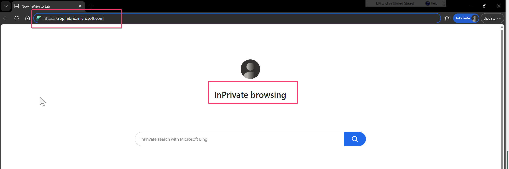
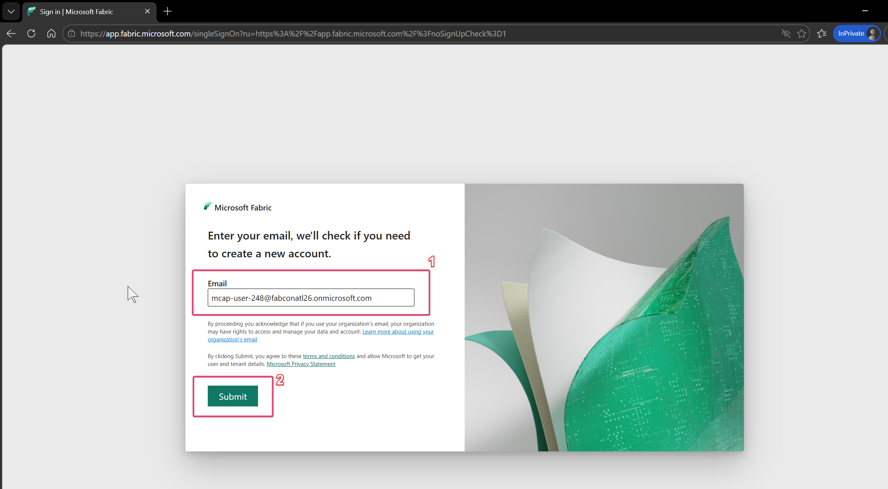
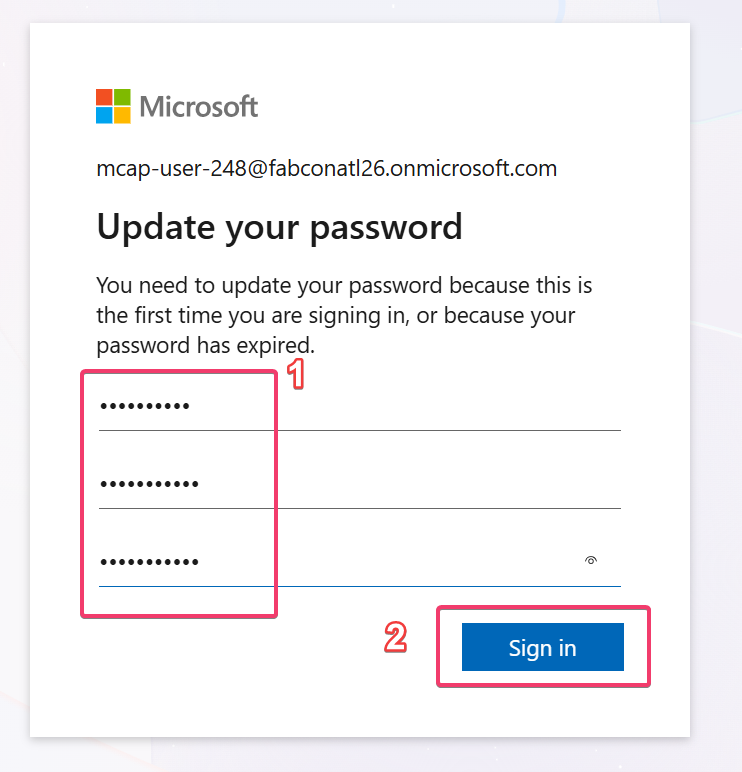
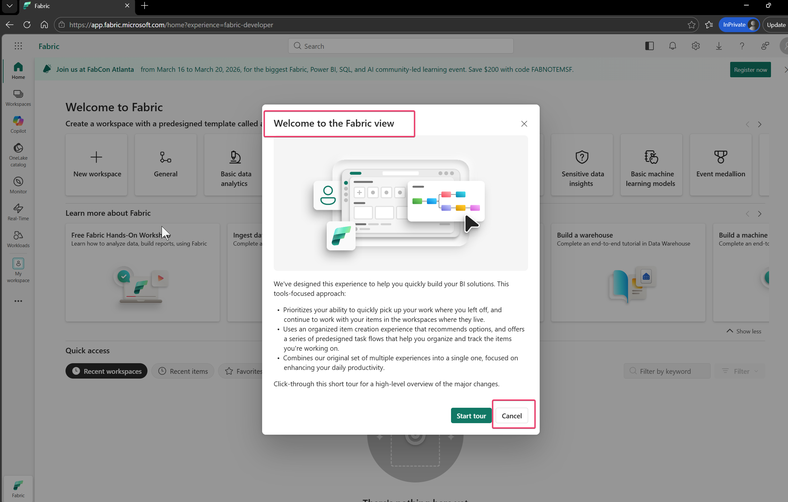
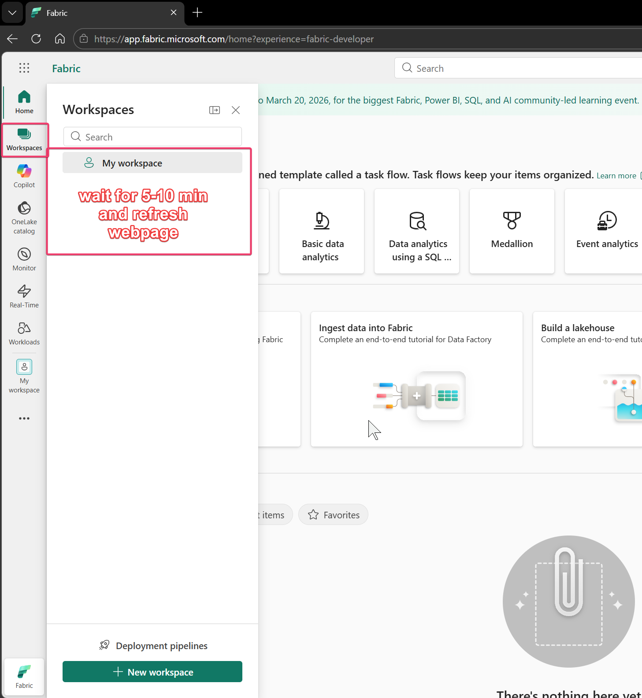
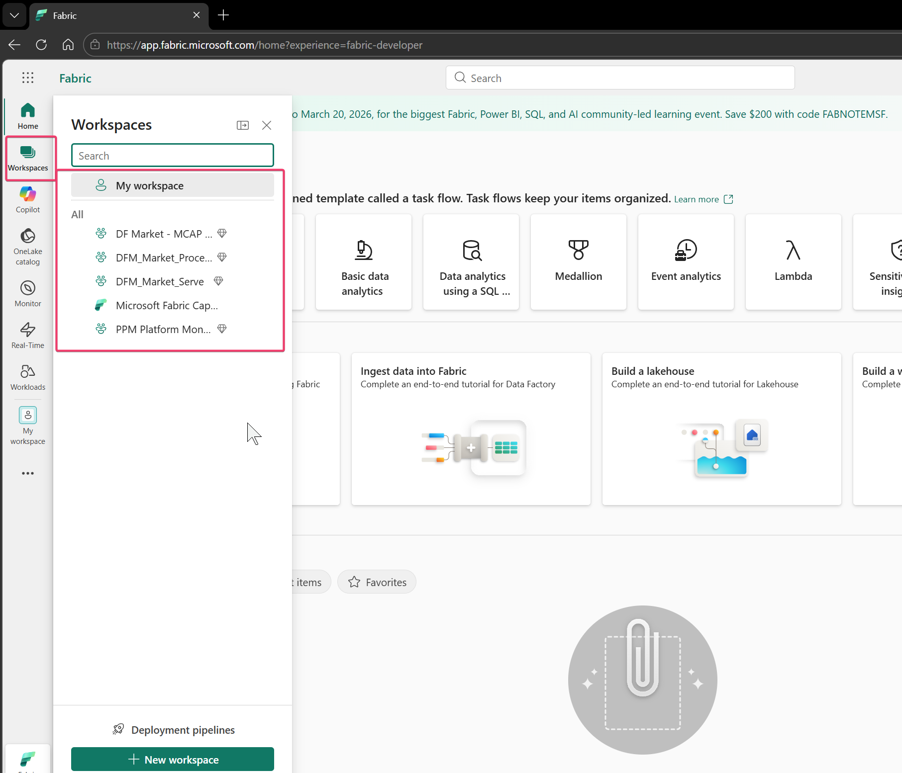

# Managing Capacities - Setup

## Setup

### Step 1
Every user should have a username and password shared with you. If you do not have one, please contact the instructor or lab proctor.

### Step 2
Access a browser from your own device.

- a. You can use InPrivate / Incognito mode in the browser.
- b. Or you can use profiles and create a profile for the user.

### Step 3
Access Fabric using the given username.

- a. Go to https://app.fabric.microsoft.com (copy and paste the link into an InPrivate browser window if you want).

- b. Provide your email ID and password.

.png>)

- c. It will ask you to change or reset your password the first time.

.png>)

- d. If you get a screen for MFA, you can ignore it.
- e. You should land on the Fabric portal home screen.
- f. If you see the "Welcome to the Fabric View" pop-up, you can click Cancel.

<strong>Note:</strong> If you immediately go to Workspaces, you may not see anything apart from My Workspace. Give the account at least 5-10 minutes to activate before you start the lab. After 5-10 minutes, refresh the webpage and you should see the "Microsoft Fabric Capacity Metrics" workspace.

### Step 4
If you immediately go to Workspaces, you may not see anything apart from My Workspace. Give the account at least 5-10 minutes to activate before you start the lab.

### Step 5
After 5-10 minutes, refresh the webpage and you should see other workspaces such as:

- a. Microsoft Fabric Capacity Metrics
- b. DF Market - MCAP GRP 1 / 2
- c. DFM_Market_Serve

