# Managing Capacities - Using Capacity Metrics App

## Scenario
On Sat Mar 14th, around 12:30 AM, many users reported slowness in the reports. Identify what was happening at that time and determine:

1. Why there was slowness.
2. Which workspaces were active around that time and consuming the most.
3. Which items in the workspace were consuming the most.
4. Whether the usage pattern for those items stayed the same or suddenly started consuming more.
5. Which model was impacted.

## Lab 2

### Step 1
In Workspaces, you should also see the following workspaces:

- a. Microsoft Fabric Capacity Metrics
- b. DF Market - MCAP GRP 1 / 2
- c. DFM_Market_Serve

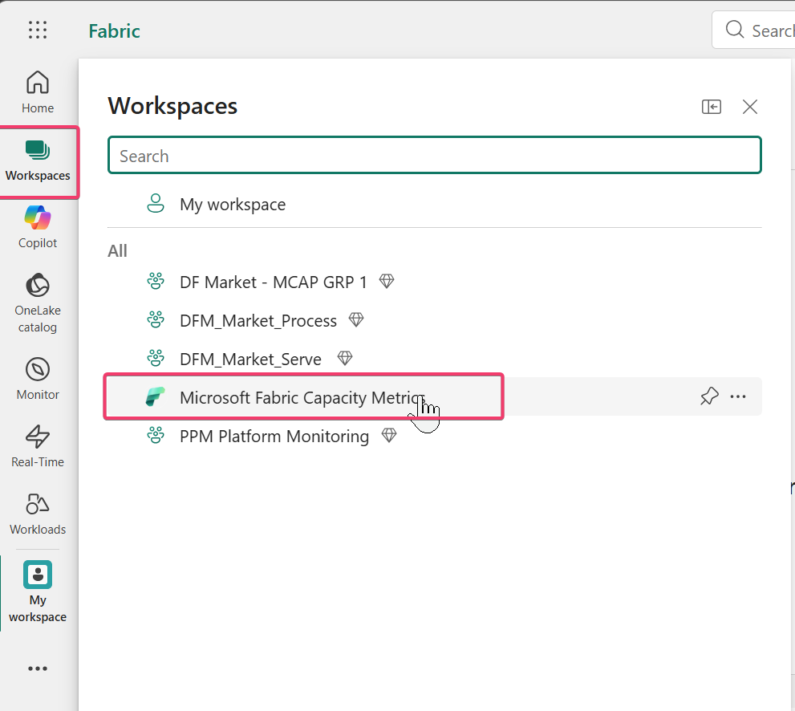

### Step 2
If you do not see the Capacity Metrics App workspace:

- a. Then use this link to access the report.

Link For Capacity Metrics App:

https://app.fabric.microsoft.com/links/JuejKgYwZI?ctid=f527843b-95a5-498e-b6d4-e8895b9816c6&pbi_source=linkShare

(copy and paste the link into an InPrivate browser window)

### Step 3
Click on the workspace "Microsoft Fabric Capacity Metrics".

- a. Click OK or Got it for any pop-ups.

### Step 4
Click the Report "Fabric Capacity Metrics".

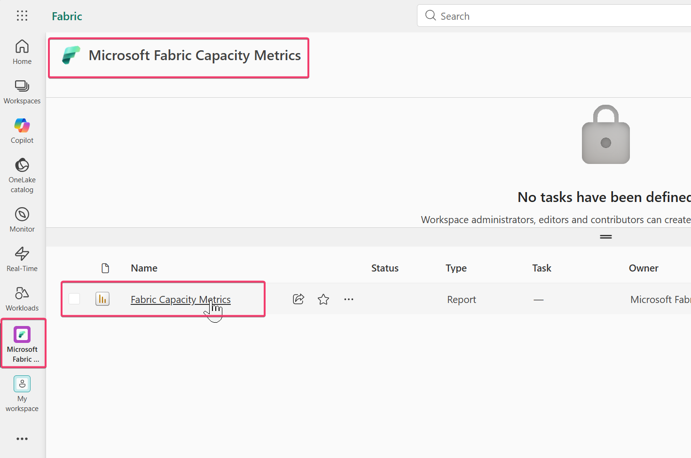

### Step 5
You should land on the "Health (Preview)" page.

- a. Check for the capacity utilization for all capacities in that region (West US).
- b. Observe the following cards:
  - i. # Throttled Capacities - Capacities throttled in the last 24 hours
  - ii. # Interactive Rejected Capacities - Capacities having Interactive Rejection in the last 24 hours
  - iii. # Background Rejected Capacities - Capacities having Background Rejection in the last 24 hours
- c. Check the table below that shows the health of each capacity.
- d. Look for columns:
  - i. Health
  - ii. Throttling (s)
  - iii. P95 interactive delay
  - iv. P95 interactive rejection
  - v. P95 background rejection
- e. If you move your mouse to the top-right corner of the table, you will see a "(?)" sign.

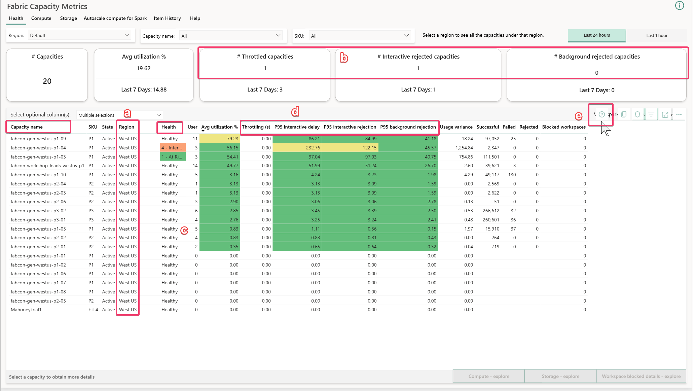

<strong>Note:</strong> Capacity Metrics App has this "(?)" sign for each visual to provide brief documentation about the visual as well as the page. Make a practice of using it whenever you need clarification about any visual.

- f. Hovering over the "(?)" sign will provide details about the table.

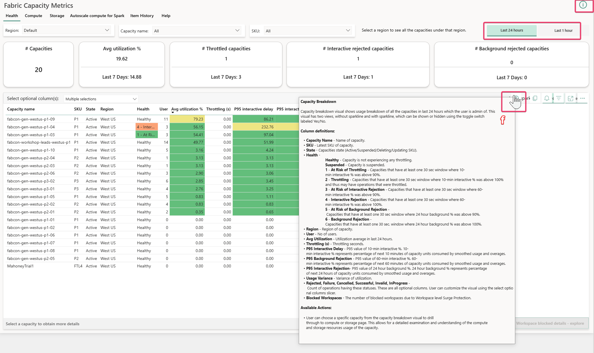

### Step 6
Identify the capacity "fabcon-gen-westus-p1-09" -> Right Click -> Compute. This will take you to the Compute page for that capacity.

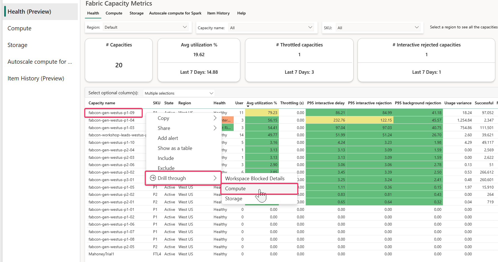

### Step 7
On the Compute page, observe utilization for the last 14 days.

<strong>Note:</strong> This Capacity Metrics App is set to the US Central time zone offset.

### Step 8
On the top-left Multi metric ribbon chart, click on "Sat 14" on the x-axis. You will see the top-right chart, "CU % over time," filtered for Sat 14th. Around 12:00 AM there is a large spike in utilization. We need to identify whether there is any throttling around that time.

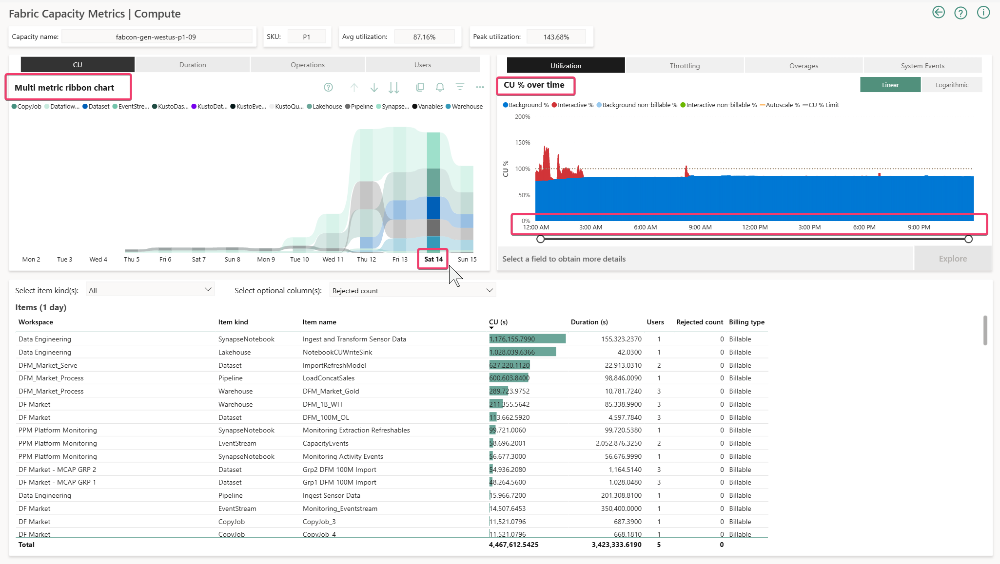

### Step 9
Click on the Throttling tab in the top-right chart. You will see the interactive delay chart showing more than 100%, which means there was interactive delay around this time.

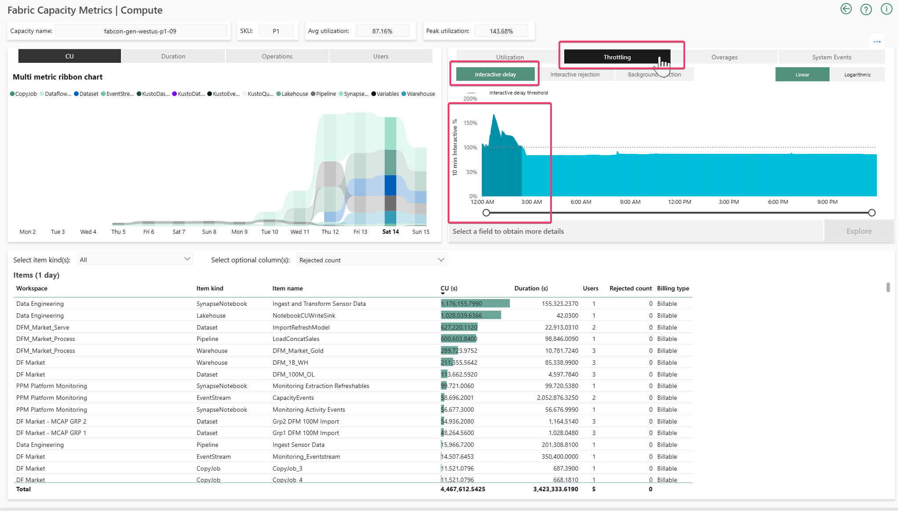

### Step 10
To further check whether there was any interactive rejection, click on the Interactive rejection tab next to the highlighted Interactive delay tab. Use it to confirm whether there was any interactive rejection.

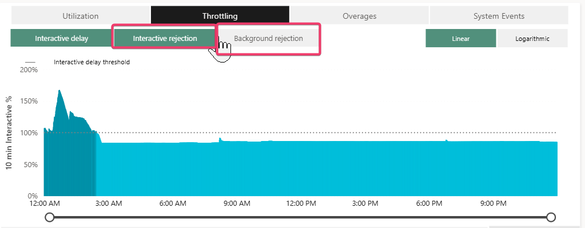

### Step 11
Click on Background rejection to also see the background rejection %.

### Step 12
Now come back to Interactive rejection. To go more granular, drill down to the hour level.

### Step 13
Click on the single down arrow to turn on drill mode. Then double-click on "Sat 14" on the x-axis. This will take you to hour-level usage in the Multi-metric ribbon chart.

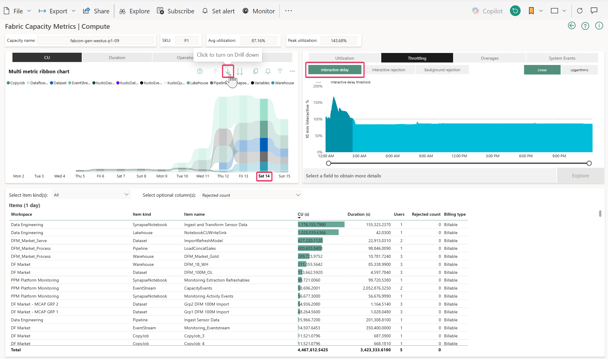

### Step 14
Important: click on the single down arrow once again to remove drill mode (set drill mode off).

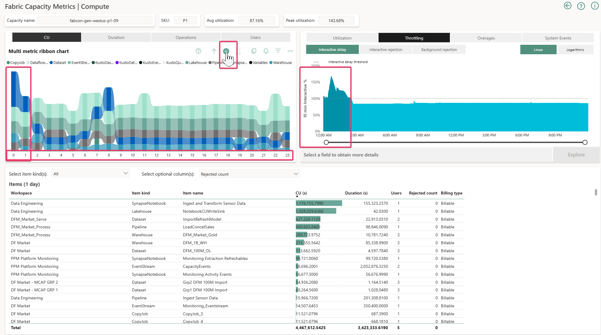

### Step 15
Click on 0 on the x-axis of the ribbon chart to see interactive delay split into one-hour timepoint chunks.

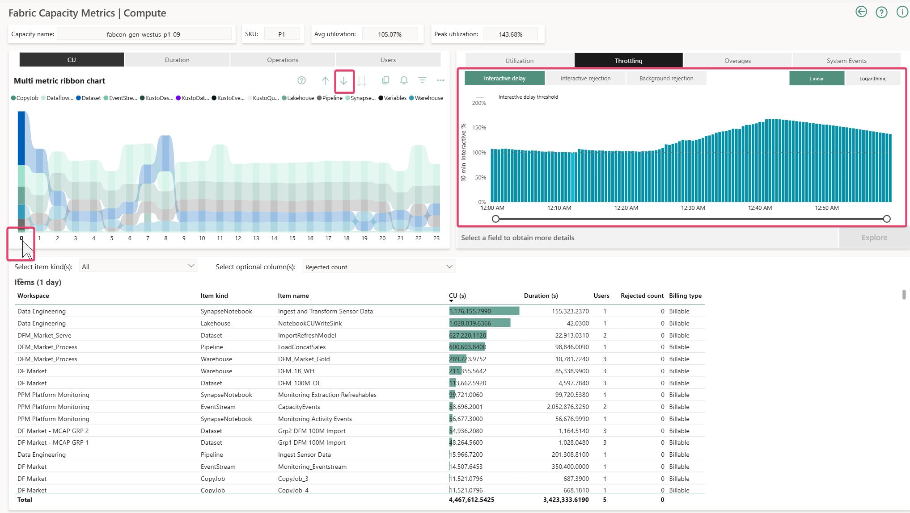

### Step 16
Right-click on the topmost timepoint (3/14/2026 12:41:30 AM) to drill through to the Timepoint Summary (Preview) page.

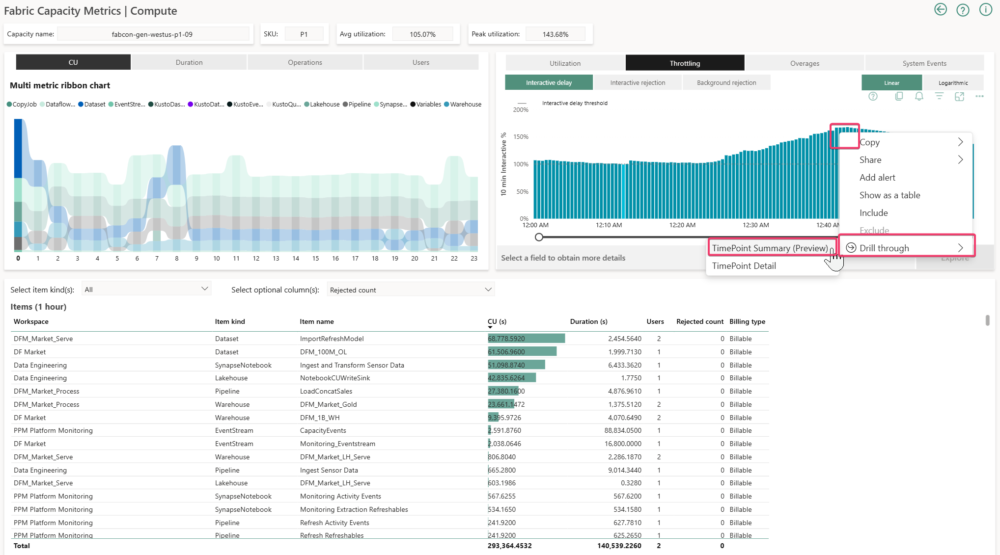

### Step 17
Observe Background usage. Click on the Interactive tab to see the interactive summary.

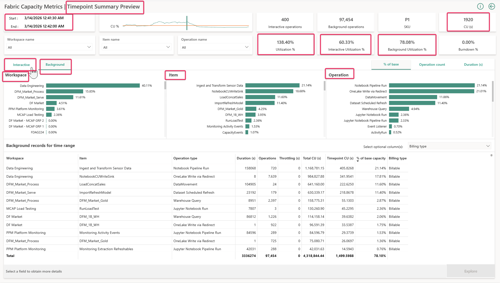

### Step 18
Identify background and interactive operations taking up CUs.

- a. You can further drill through to Timepoint Item Detail page to see item level timepoint charges.

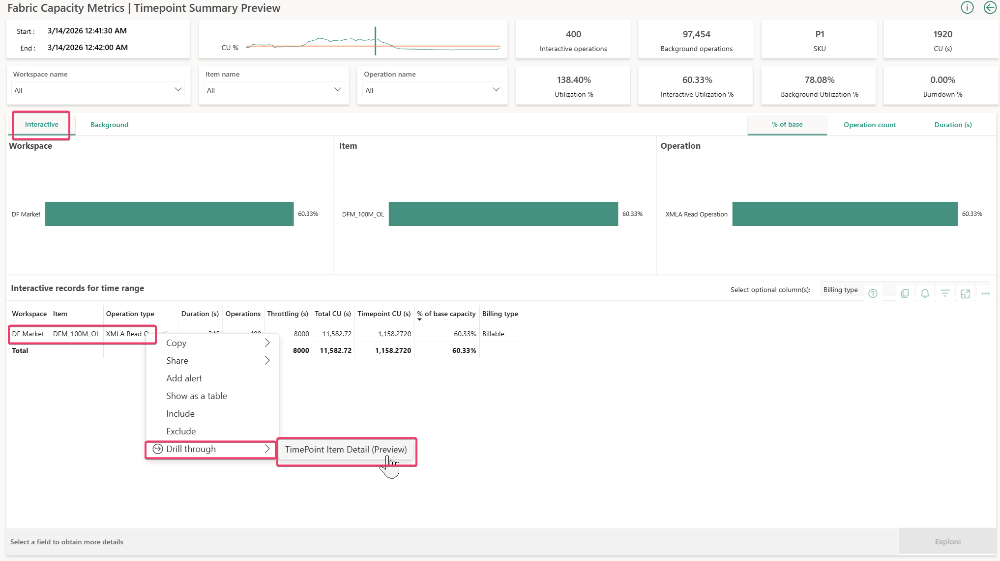

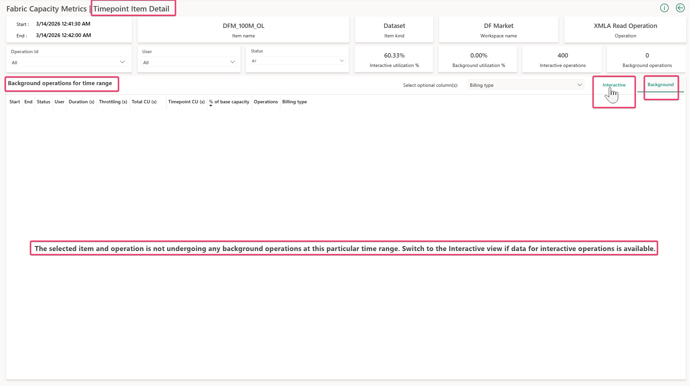

<strong>Note:</strong> By default, the Timepoint Item Detail page lands on the Background page. If you are navigating from Interactive Timepoint Summary, make sure to click on the Interactive tab on the top-right of the bottom chart.

### Step 19
Use the operation ID column to find the OperationId that you can map to Workspace monitoring.

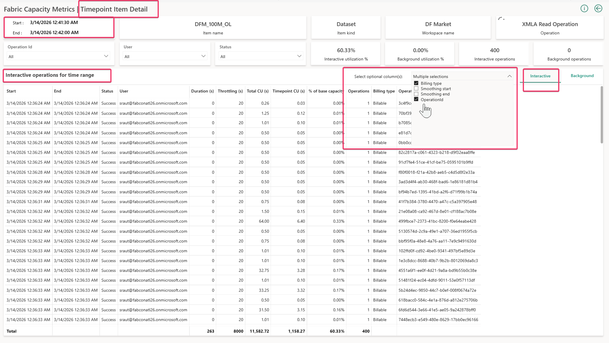

### Step 20
On the Fabric portal, create a workspace and assign it to premium capacity.

- a. Go to workspaces.
- b. Create New Workspace.
- c. Give it a name that includes the number from your username.
  - i. e.g. for user 250 the name could user250Workspace

### Step 21
Create a KQL Query Set and connect it to the monitoring KQL Database for that workspace.

<strong>Tip:</strong> You can use the following mappings to identify operations.

For Jupiter Notebook Run:

- Operation ID = Job Instance ID

For Warehouse Query:

- Operation ID = Dist_statement_id

For Semantic Model:

- Operation ID = OperationId

